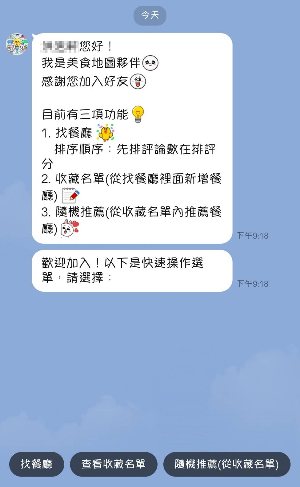
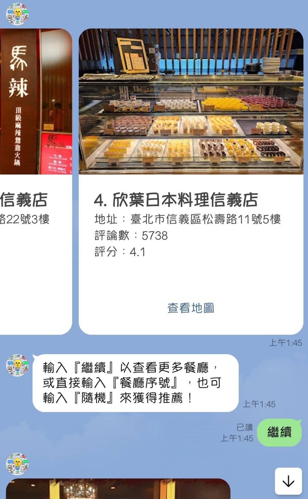
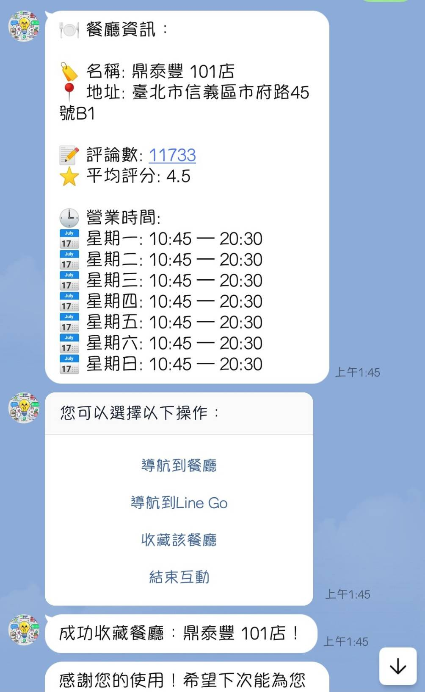

# line-美食地圖夥伴

繁體中文 | [English](./README_en.md)

這個專案將 LINE Bot 與 Google Maps API 結合，為用戶提供方便的餐廳收藏工具。

## LINE Bot 資訊

- **Bot 基本 ID**: `@798sblaw`

## 主要功能
1. **找餐廳**
   - 排序方式：餐廳按照評論數優先排序，其次為評分高低。
2. **收藏名單**
   - 用戶可以將「找餐廳」中的餐廳新增至收藏名單。
3. **隨機推薦**
   - 從用戶的收藏名單中隨機推薦一家餐廳。

更多詳細資訊，請參考[文件](https://hackmd.io/@-nXGMy8zTgK2nBlGiHohww/S1QC2z6Eye)。

    
    
    
    
    
    
    
    

## 貢獻指南

請參考[貢獻指南](.github/CONTRIBUTING.md)。

### 貢獻者

## 授權條款

本專案採用 [MIT 授權條款](LICENSE)。
