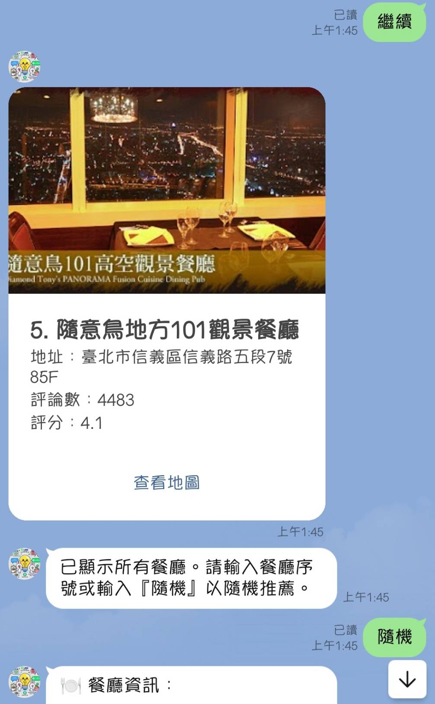

# line-dine-mapper

English | [繁體中文](./README.md)

This project integrates LINE Bot with the Google Maps API to provide users with a convenient restaurant bookmarking tool.

## LINE Bot Information

- **Bot Basic ID**: `@798sblaw`

    <h3>QR Code</h3>
    

## Main Features
1. **Find Restaurants**
   - Sorting: Restaurants are sorted first by the number of reviews, then by rating.
2. **Bookmark List**
   - Users can add restaurants to their bookmark list from the "Find Restaurants" feature.
3. **Random Recommendation**
   - Suggests a random restaurant from the user's bookmark list.

For detailed information, please refer to the [documentation-zh](https://hackmd.io/@-nXGMy8zTgK2nBlGiHohww/S1QC2z6Eye).

    <h3>Demo</h3>
    

        

            
        

        

            
        

        

            
        

        

            
        

        

            
        

        

            
        

        

            
        

        

            
        

        

            
        

    

## Contributing

Check out the [Contributing Guide](.github/CONTRIBUTING.md).

### Contributors

## License

The [MIT License](LICENSE).
